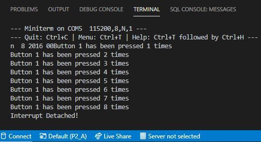

# PRACTICA 2A  :  Interrupción Por GPIO

## 1.Código

'#'include<Arduino.h>

struct Button {

    const uint8_t PIN;
    uint32_t numberKeyPresses;
    bool pressed;

};

Button button1 = {18, 0, false};

void IRAM_ATTR isr() {

    button1.numberKeyPresses += 1;
    button1.pressed = true;

}

void setup() {

    Serial.begin(115200);
    pinMode(button1.PIN, INPUT_PULLUP);
    attachInterrupt(button1.PIN, isr, FALLING);

}

void loop() {

    if (button1.pressed) {

        Serial.printf("Button 1 has been pressed %u times\n", button1.numberKeyPresses);
        button1.pressed = false;

    }

//Detach Interrupt after 1 Minute

    static uint32_t lastMillis = 0;

    if (millis() - lastMillis > 60000) {

        lastMillis = millis();
        detachInterrupt(button1.PIN);
        Serial.println("Interrupt Detached!");

    }

}

## 2.Funcionamiento

Primero de todo, indicamos que vamos a asociar al pin 18 una interrupción con el modo FALLING "attachInterrupt(button1.PIN, isr, FALLING)", que hace que la interrupción se ejecute cuando pase de HIGH a LOW, es decir, una vez pulsamos el interruptor, conectado por un lado al pin 18 y por otro a GND, se ejecutará el "Serial.printf("Button 1 has been pressed %u times\n", button1.numberKeyPresses)". 

Una vez se realiza la interrupción, la desconectaremos con la función "detachInterrupt(button1.PIN)". Más tarde, haremos la rutina de servicios IRAM_ATTR isr(). 

Pasado 1 minuto, después de la ejecución del programa, nos saldrá por el terminal "Interrupt Detached!".

Hay que recalcar que en este código no utilizamos la función delay(), sinó la función millis(), cuya función es retornar los ms del ciclo que está funcionando el procesador. Ésto permite ganar mucha más eficiencia que con el delay().

## 3.Salida Del Terminal

